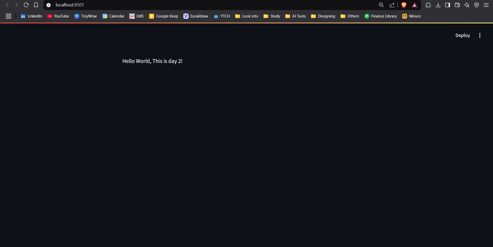

# 30-days-with-streamlit

This repository is for learning streamlit following the exercies given in [30 days with Streamlit](https://30days.streamlit.app/) 

### Day 1 

    

        Creating an environment to run Streamlit and launching a demo app.  
    

### Day 2

    

        Building your first Streamlit app  
    

